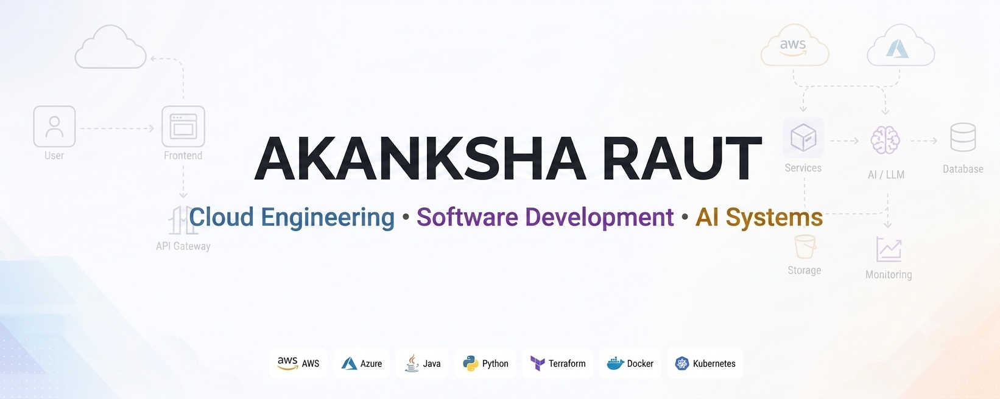

<!--
================================================================================
  GITHUB PROFILE README — SETUP GUIDE
================================================================================
  This file powers your GitHub profile page (the special repo named exactly
  after your username, e.g. github.com/YOUR-USERNAME/YOUR-USERNAME).

  BEFORE PUBLISHING, REPLACE THE FOLLOWING:
  --------------------------------------------------------------------------
  1. YOUR-USERNAME        → your GitHub username (appears in stats/snake URLs)
  2. assets/banner.png    → already referenced below. Optionally add a
                             assets/banner-dark.png for a true dark-mode
                             banner (see the <picture> tag notes).
  3. LINKEDIN-URL          → your LinkedIn profile URL
  4. MEDIUM-USERNAME       → your Medium handle (for the RSS-based article feed)
  5. YOUR-EMAIL             → your contact email
  6. Featured Projects     → swap in your real repos, descriptions, and links
  7. Tech Stack icons      → add/remove tools from the skillicons.dev query
  --------------------------------------------------------------------------
  This file is pure Markdown + embedded HTML, fully compatible with GitHub's
  renderer. No build step required.
================================================================================
-->

<!-- ============================ 1. BANNER ============================ -->
<!-- Uses your uploaded assets/banner.png. If you later create a separate
     dark-mode version, save it as assets/banner-dark.png and it will be
     picked up automatically via prefers-color-scheme. -->
<picture>
  <source media="(prefers-color-scheme: dark)" srcset="assets/banner-dark.png">
  <source media="(prefers-color-scheme: light)" srcset="assets/banner.png">
  
</picture>

 

<!-- ======================= 2 & 3. NAME + TAGLINE ======================= -->
# Hey There! 👋

### From Architecture to Deployment

<!-- ========================= 4. TYPING SVG ============================ -->

  

<!-- =========================== BADGES ROW ============================= -->

 

<!-- ========================== 6. ABOUT ME ============================= -->
<table>
<tr>
<td width="65%" valign="top">

## About Me

I work across the stack that sits between "code is written" and "code is
reliably running in production" - cloud infrastructure, platform tooling,
and the automation that connects the two.

My background spans enterprise-scale endpoint automation, large OS
migrations, and device lifecycle management for thousands of production
endpoints, followed by hands-on work in incident recovery and leading a
small team of engineers. That experience shaped how I think about systems:
reliability and repeatability matter as much as the initial build.

I'm currently deepening my foundation in distributed systems and cloud
architecture through a master's program, with a focus on:

- ☁️ **Cloud infrastructure** — AWS and Azure, infrastructure as code, and
  well-architected system design
- 🧩 **Platform engineering** — building internal tools and workflows that
  make deployment and operations faster and safer
- 🤖 **Applied AI systems** — using AI where it solves a real operational
  problem, not as a feature for its own sake
- 🛠️ **Production reliability** — monitoring, incident response, and
  systems designed to fail gracefully

I care about building things that hold up after the demo - documented,
observable, and maintainable by someone other than me.

</td>
<td width="35%" valign="top" align="center">

<!-- Replace this illustration with your own asset in /assets if preferred.
     Any transparent-background SVG/PNG works well here. -->

</td>
</tr>
</table>

 

<!-- ======================== CURRENT FOCUS ============================= -->
## 🎯 Current Focus

- 🔭 Building small production-grade projects that mirror real cloud
  architecture patterns — not tutorials, but systems with logging,
  error handling, and deployment pipelines
- 📚 Working toward an **AWS Certified Solutions Architect – Associate**
- 🧠 Exploring how AI tooling fits into platform engineering workflows —
  from CI/CD assistance to intelligent operational alerting
- 🤝 Open to conversations about **Cloud Engineering**, **Software Development**, **Platform
  Engineering**, and **DevOps/SRE** roles

 

<!-- ========================== TECH STACK ============================== -->
## 🧰 Tech Stack

<!-- Full icon list & names: https://skillicons.dev
     Edit the `i=` query above to add or remove tools. -->

 

<!-- ======================== FEATURED PROJECTS ========================= -->
## 🚀 Featured Projects

<!-- Replace each card below with your own repositories.
     Keep the table structure — it renders as clean side-by-side cards. -->
<table width="100%">
<tr>

### 📦 Internal Developer Platform
A lightweight internal developer platform providing self-service
environment provisioning and standardized service templates.

`Python` `Docker` `Kubernetes`

</td>
</tr>
<tr>
<td width="50%" valign="top">

### 🤖 AI-Assisted Ops Assistant - Dalbot
A tool that summarizes incident logs and suggests likely root causes
using an LLM, reducing initial triage time.

`Python` `AWS Lambda` `LLM API`

</td>
<td width="50%" valign="top">

</table>

 

<!-- ===================== GITHUB STATS (PINK THEME) ==================== -->
## 📈 GitHub Stats

 

<!-- If any stat card shows an error, GitHub's stats API is rate-limited or
     the username is wrong — double-check YOUR-USERNAME above. -->

 

<!-- ========================= LATEST ARTICLES ========================== -->
## ✍️ Latest Articles

<!-- STATIC PLACEHOLDER — replace links below with real article URLs, OR
     automate this list with the "blog-post-workflow" GitHub Action:
     https://github.com/gautamkrishnar/blog-post-workflow
     That action rewrites the block between the START/END comments below
     on a schedule, pulling from your Medium RSS feed automatically. -->

<!-- BLOG-POST-LIST:START -->
- [The Problem Nobody Talks About in Software Engineering](https://medium.com/@akanksha.raut.2662/the-problem-nobody-talks-about-in-software-engineering-96d0e7296ca8)
- [https://medium.com/@akanksha.raut.2662/i-thought-building-an-ai-chatbot-was-about-choosing-a-better-model-i-was-wrong-82eff10c1a93](https://medium.com/@akanksha.raut.2662/i-thought-building-an-ai-chatbot-was-about-choosing-a-better-model-i-was-wrong-82eff10c1a93)
- [Can we share information without giving away possession?](https://medium.com/@akanksha.raut.2662/data-capsule-can-we-share-information-without-giving-away-possession-76491d55c82e)
<!-- BLOG-POST-LIST:END -->

 

<!-- ============================= CONNECT =============================== -->
## 🤝 Connect

 

<!-- ====================== CONTRIBUTION SNAKE =========================== -->

<!-- This image is generated automatically by the GitHub Action in
     .github/workflows/snake.yml — see that file's header comment for
     one-time setup steps (Settings → Actions → enable "Read and write
     permissions"). It will render blank until the workflow has run once. -->

 

<!-- ========================= FOOTER (CAPSULE) =========================== -->

